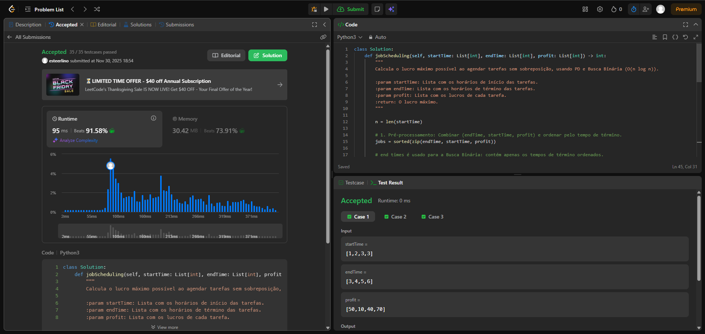
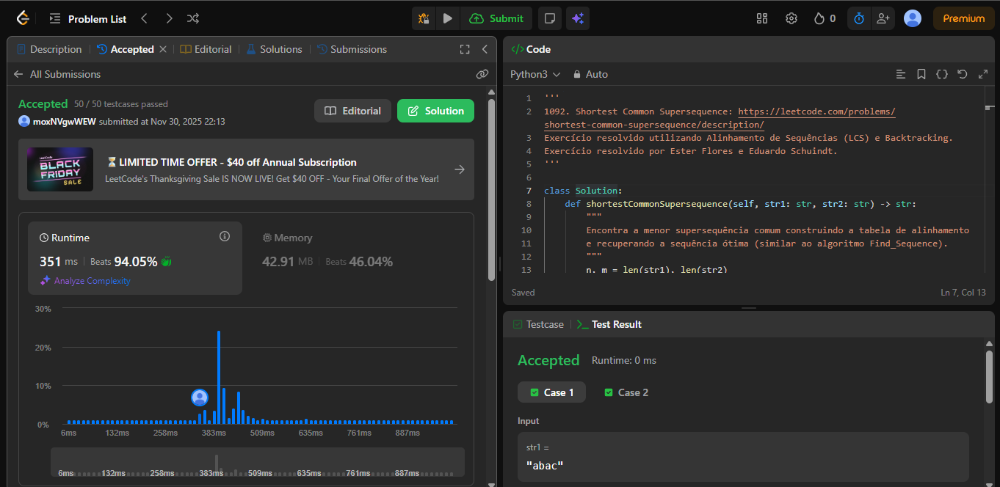
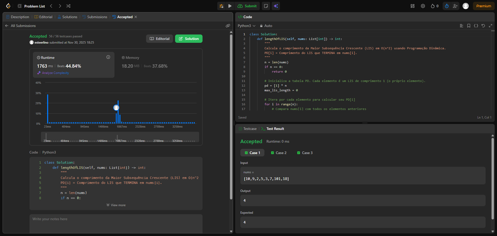
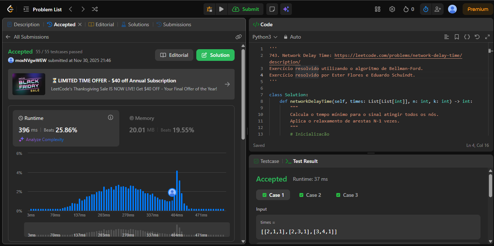

# Trabalho 5 - Programação Dinâmica

**Número do trabalho:** 5  
**Conteúdo da Dsiciplina: Programação Dinâmica**

## Alunos

| Matrícula |        Nome Completo       |
|:---------:|:-------------:|
| 20/2063201 | Ester Flores Lino da Silva |
| 20/2042927 | Eduardo Schuindt Santos    |

## Definição do Trabalho

Para o Trabalho 5 a dupla optou por solucionar questões da plataforma **[LeetCode](https://leetcode.com/)**. Seguindo as orientações do professor Maurício Serrano, resolvemos 4 desafios. Dois do nível difícil e dois do nível médio. Dessa maneira, a dupla busca demonstrar o conhecimento adquirido durante as aulas e estudos sobre o tema Programação Dinâmica.

Sobre a realização do trabalho, cada exercício contém seu código resposta, screenshots da tela de submissão do **[LeetCode](https://leetcode.com/)** e vídeo de até 5 minutos explicando objetivamente as resoluções propostas.

## Linguagem utilizada

A linguagem de programação utilizada para resolver cada exercício foi o Python.

## Screenshots

### Exercício 01 - Difícil - 1235. Maximum Profit in Job Scheduling

### Exercício 02 - Difícil - 1092. Shortest Common Supersequence  

### Exercício 03 - Médio - 300. Longest Increasing Subsequence

### Exercício 04 - Médio - 743. Network Delay Time

## Vídeo de apresentação do Trabalho 5

[Link da apresentação do Trabalho 5]()

## Verificação

Para verificar se as resoluções aqui propostas estão corretas e foram aceitas, submeter os códigos no **[LeetCode](https://leetcode.com/)** e conferir se foi aceito ou não. Todo exercício contém o link para descrição do problema no seu próprio código de resolução.
